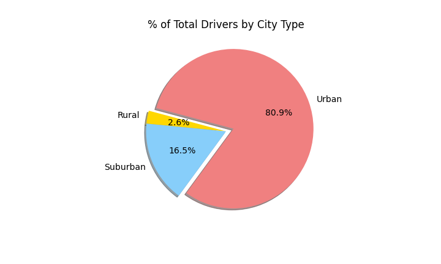
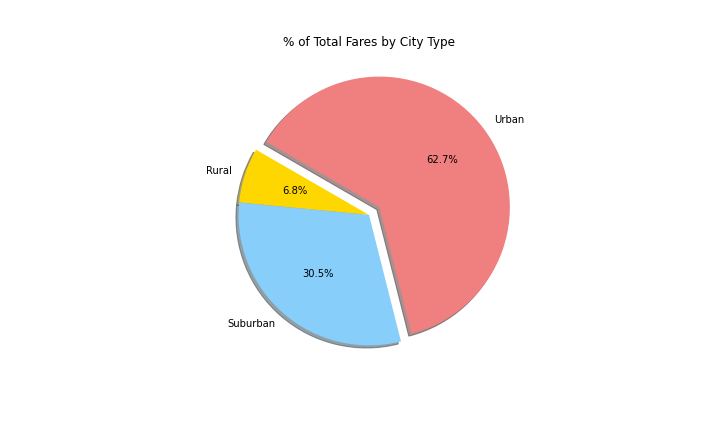

# PyBer_Analysis
Analyzing ride share data using Python, Pandas and Matplotlib

## Overview

Ride sharing apps have become a popular way for many people to get around. In comparison to public transportation options, which have limited routes, hours, and service locations, ride share apps overcome these limitations by contracting drivers. As long as there's sufficient demand, ride share apps can offer service to riders in any location at any time. 

The goal of this project is to analyze data from the ride share app PyBer to compare how the app performs in different types of cities: Urban, Suburban, and Rural. Specifically, we we look at total rides, total drivers, average fare per ride, and average fare per driver for each city type. The results from this analysis will be used to make reccomendations that help address service disparities among the city types.

## Results

### PyBer Analysis Summary:

The table above is a summary of the analysis performed on ride share data for PyBer in 2019. The greatest number of total rides, drivers, and fares are seen in urban cities, followed by suburbuan cities, and lastly by rural cities. Average fare per ride and per driver are highest in rural areas and lowest in urban areas. 

From these data we can see an inverse correlation between average fare and total number of rides (and drivers) based on city type. 

#### 1. Total Rides
Urban cities had the greatest proportion of total rides in 2019 at 68.4% (1,625 rides). Suburban cities represented the next greatest proprotion of total rides at 26.3% (625 rides), followed by rural cities which contributed to only 5.2% of the total rides (125 rides).

#### 2. Total Drivers
Urban cities had the greatest proportion of total drivers in 2019 at 80.9% of total drivers (2,405 drivers). The number of drivers in suburban cities was 16.5% of the total (490 drivers), and the number of drivers in rural cities represented only 2.6% of the total (78 drivers).

#### 3. Total Fares
In terms of profitability, urban cities contributed the greatest proportion of total fares in 2019 at 62.7% ($39,854). Suburban and rural cities contributed 30.5% ($19,356) and 6.8% ($4,327) of the total fares respectively. 

Looking at total fares by city over the course of the year, we can see that the total fare per week remains relatively constant betwen January and May for all three city types. There does appear to be a slight spike in total fares for all three city types in the last week of February, but other than that there aren't any particular months that appear to be significantly more or less profitable. 

#### 4. Average Fare per Ride
The average ride fare in urban cities was the lowest at $24.53 per ride. The average ride fare in suburban cities was slightly higher at $30.97 per ride. The highest average ride fare was observed in rural cities at $34.62 per ride. Rural cities had a high degree of variability in the average ride fare, which is likely due to having some rides with longer distances due to the spread out nature of rural cities. 

#### 5. Average Fare per Driver
The average fare per driver in urban cities was also the lowest at $16.57 per driver. The average fare per driver in suburban cities was more than double that of urban cities at $39.50 per driver. The highest average ride fare per driver was in rural cities at $55.49 per driver, which is more than triple the average fare for urban city drivers. 

#### 6. Average Ride Count 
The average ride count for each city type reflects the same trend observed in **1. Total Rides**. The greatest average ride count per city was in urban cities at 24.6 rides per city, followed by suburban cities at 17.3 rides per city, and finally by rural cities at 6.9 rides per city.

---------------------------------

Collectively, these data demonstrate an inverse correlation between average fares and total number of rides (and drivers) based on city type. 

## Summary
We can see the data follow a trend based on city type. In urban cities, which are generally more populous and compact, the total rides, drivers and fares are greater than the less populated suburbs, and much greater than the least populous rural cities. Even though drivers in urban cities make 3x less per ride on average than rural cities, they can make up for this by accepting more rides. Conversely, though rural drivers have the highest average fare per driver, these drivers will ultimately make less money because they accept much fewer rides. This is likely the result of rider demand. The more peoople there are in a given area, the more rides there will likely be. People in urban cities may also be more willing to use a ride share app because the distance they're going is shorter compared to riders in rural areas, meaning the average ride fare will be less expensive. 

Based on this information, we can make a couple of recommendations to help improve the disparity in total rides and drivers between rural cities, and more populated suburban and urban cities.  

1. *Provide incentives to drivers for accepting rides in rural cities. 

   Increasing the number of drivers in rural cities may influence more riders to download and use the app. The low demand in rural areas may be a cyclical problem. If riders in rural areas have issues finding available drivers, they may be less likely to use the app in the future. In turn drivers will be less likely to go to these areas knowing it will de difficult to find rides. If we first increase driver availability, riders in rural cities will begin to use the app more regularly. 
 
 
2. *Increase ride share app advertising in rural cities and offer discounts to drivers.

   Once riders in rural areas become used to using PyBer, rates can gradually increase, but to draw these customers in initially, promotions and discounts should be offered. Social media campaigns targeted to rural areas can also be helpful in increasing rider demand as these people already have familiarity using apps.
  

3. *Include an "call in" alternative to the app.

   People who don't have access to smart devices are unable to use ride share apps, and this is more common in rural areas compared to suburbuan and urban areas. Having a phone number that people could call in on to request a ride, similar to a taxi service, could increase rider demand in all city types, but especially in rural cities.
